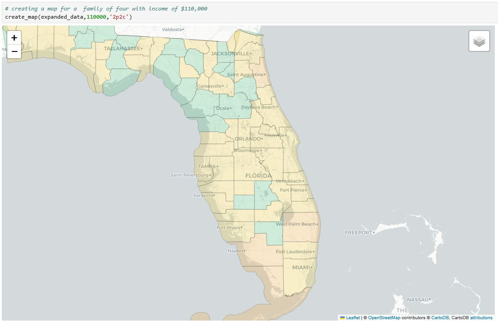

# Affordability of Living in Florida by County

This project visualizes county data for Florida, showing affordability ratings based on various factors like income and cost of living.

## Installation

To run this project, you will need Python and the following libraries:
- pandas
- geopandas
- folium
- numpy
- openpyxl

# 🗺️ Florida Affordability Map

This interactive map helps users explore the affordability of Florida counties based on household income and cost of living data.

---

## 📌 Project Overview

Choosing a place to live can feel overwhelming. This project simplifies that decision by providing a visual tool that compares household income to the cost of living in each Florida county. Users can quickly see where they can afford to live, based on income and household size.

---

## 💡 Key Features

- 📊 Visualize affordability across Florida's counties.
- 👨‍👩‍👧 Household-size specific cost of living comparisons.
- 💵 Adjusts for income levels from $0 to $200,000.
- 🧮 Includes affordability ratios and surplus/deficit values.

---

## 🧰 Technologies Used

- Python
	- pandas
	- geopandas
	- folium
	- numpy
- Jupyter Notebook
- Binder (for launching notebook)

---

## 🚀 Try it in Binder

Click the badge below to launch an interactive version in your browser:

---

## 📁 How to Use

1. Launch the notebook via Binder or clone the repo locally.
2. Open the Jupyter Notebook.
3. Adjust the income and household size inputs to view affordability.
4. View color-coded county maps and output summaries.

---

## 📈 Sample Output

---

## 🔍 Data Sources

- [United States Census Bureau](https://data.census.gov/all?q=cost%20of%20living%20florida)
- [The Economic Policy Institute’s Family Budget Calculator](https://www.epi.org/resources/budget/budget-map/)

---

## 🧠 What I Learned

- How to clean and merge multiple datasets.
- Building geographic visualizations using GeoPandas.
- Turning abstract questions into data-driven tools.

---

## 🗣️ Future Work

- Expand beyond Florida to other U.S. states.
- Include public transportation and quality-of-life factors.
- Deploy a web version (e.g., Streamlit or Dash).

---

## 👋 About Me

Hi, I’m Mark! I enjoy simplifying complex decisions using data. If you're interested in this work or want to collaborate, feel free to connect.

---

## 📬 Contact

- [LinkedIn](www.linkedin.com/in/mark-izevbigie)
- [Email](mailto:markizevbigie@gmail.com)
